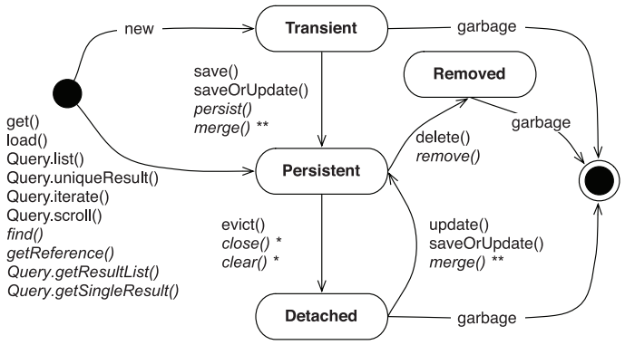

# The persistent lifecycle

- classes are unaware of their own persistence capability [+];
- *persistence lifecycle*: the states an object goes through during its life;
- *unit of work*: a set of operations you consider one (usually atomic) group;

## The persistent states

- Transient

    - objects instantiated using the new operator aren’t immediately persistent;
    - any modification of a transient instance isn’t known to a persistence context;
    - Hibernate doesn’t provide any roll-back functionality;
    - objects that are referenced only by other transient instances are transient;
    
- Persistent

    - is an entity instance with a database identity;
    - has a primary key value set as its database identifier;
    - is always associated with a persistence context;
    - may be an instance retrieved from the database by execution of a query;
    - may be objects instantiated by the application and then made persistent by calling one 
      of the methods on the persistence manager;
    
- Removed

    - can be removed by an explicit operation of the persistence manager;
    - is removed when there is no reference to it;
    
- Detached

    - *handle*: a reference to the instance that was saved;
    - its state is no longer guaranteed to be synchronized with database state;
    - there is a way to bring the detached instance back into persistent state:
        - reattachment;
        - merging;
    
## The persistent context

- is a first-level cache of managed entity instances:
    - *repeatable read* for entities;
    - can't be turned off:
        - there is no stack overflows in the case of circular references in a graph of objects;
        - there can never be conflicting representations of the same database row at the end of a unit of work;
        - changes made in a particular persistence context are always immediately visible to all other code executed
        inside that persistence context;
- allows dirty checking and transactional write-behind;
    - Hibernate doesn’t update the database row of every single persistent object in
      memory at the end of the unit of work;
    - an object with modifications that have not yet been propagated to the database is considered *dirty*;
    - with *transparent transaction-level write-behind*, Hibernate propagates state changes to the database
    **as late as possible**;
    - Hibernate tries to keep lock-times in the database **as short as possible**;
    - Hibernate includes all columns of a mapped table in the SQL UPDATE statement (`dynamic-insert="true"`
    to turn this off);
- guarantees a scope of Java object identity:
    - the unit of work starts when the user sends a request and ends when processing is complete and the response for 
    the user is ready - *the session-per-request strategy*;
    - Hibernate supports long-running unit of work the *conversation*:
        - *session-per-request-with-detached-objects* - objects are held in detached state during user think-time,
        and any modification of these objects is made persistent manually through reattachment or merging;
        - *session-per-conversation* - you extend a persistence context to span the whole unit of work:
            - *no identity scope* - no guarantees that if a row is accessed twice the same Java object instance 
            will be returned;
            - *persistence context-scoped identity* - only one object instance represents a particular database row;
            - *process-scoped identity* - only one object instance represents the row in the whole JVM;
    - **business key equality** should be used with:
        - real-world attributes;
        - immutable or rarely changed attributes;
        - time-based attributes;
- spans a whole conversation:
    - the persistence context isn’t closed after a request from the user has been processed;
    - when the user continues in the conversation, the persistence context is reconnected to the database;
    - the next conversation starts with a fresh persistence context and doesn’t reuse any entity instances from
    the previous conversation
    - eliminates the detached object state;

## The Hibernate interfaces

- a persistence manager API includes:
    - basic CRUD (create, retrieve, update, delete) operations;
    - query execution;
    - control of transactions;
    - management of the persistence context;
- storing and loading objects:
    - beginning a unit of work:
        - open a session `sessionFactory.openSession()`:
            - `SessionFactory` creation is extremely *expensive*;
            - `Session` creation is extremely *inexpensive*;
        - start a transaction `session.beginTransaction()`;
    - making an object persistent:
        - instantiate an object;
        - call `save()` to make the transient instance persistent:
            - obtains a JDBC connection and issues a single INSERT statement;
            - guarantees that the item object has an assigned database identifier after it has been saved;
        - get an ID as a result;
        - commit the transaction `transaction.commit()`;
        - close the session `session.close()`;
- retrieving a persistent object:
    - retrieval by identifier:
        - `get()`:
            - returns `null` if no row found;
            - never returns a proxy;
        - `load()`:
            - an identifier value wrapped in a placeholder that looks like the real thing;
            - throws an `ObjectNotFoundException`;
            - may return a proxy without hitting the database;
            - it’s common to obtain a persistent instance to assign it as a reference to another instance;
    - retrieval by instance:
        - TODO
- modifying a persistent object:
    - automatic dirty checking during `flush()` when `transaction.commit()` is called;
- making a persistent object transient:
    - `session.delete()` - an object has to be loaded into the persistence context before;
    - the DELETE is executed only when the `Session`’s persistence context is synchronized with the database
    at the end of the unit of work;
    - both the in-memory object instance and the persistent database row will have been removed;
- replicating objects:
    -  you need to retrieve objects from one database and store them in another;
- working with detached objects:
    - reattaching:
        - a modified detached instance:
            - `update()` is reattaching the detached instance to the new `Session` (and persistence context);
            - `select-before-update="true"` to turn on comparing the object’s current state to the current database
            state;
        - an unmodified detached instance:
            - `lock()` guarantees that the object’s state changes from detached to persistent and will be managed again;
    - making a detached object transient:
        - `delete()` deletes its persistent state from the database:
            - reattaches the object to the Session;
            - schedules the object for deletion, executed on `commit()`;
    - merging the state of a detached object:
        - `merge()`:
            - checks whether a persistent instance in the persistence context has the same database identifier
            as the detached instance you’re merging;
            - if there is an equal persistent instance copies the state of the detached instance onto the
            persistent instance;
            - if there is no equal persistent instance in the persistence context, loads it from the database, merges 
            the detached state with the retrieved object’s state;
            - if there is no equal persistent instance in the persistence context, and a lookup in
            the database yields no result, a new persistent instance is created, and the state of
            the merged instance is copied onto the new instance and returned by the `merge()`;
- managing the persistence context:
    - controlling the persistence context cache:
        - keep the size of your persistence context to the necessary minimum;
        - call `session.evict(o)` to detach a persistent instance manually from the cache;
        - call `session.clear()` to detach all persistent instances from the context;
        - `session.setReadOnly(object, true)` to disable dirty checking for a particular instance;
    - flushing the persistence context:
        - changes aren’t immediately propagated to the database;
        - flushing occurs at the following times:
            - a `Transaction` is committed;
            - before a query is executed (only if changes are held in memory that would **affect the results**
            of the query); 
            - `session.flush()`;
    - you can control `FlushMode` via `session.setFlushMode()`:
        - `FlushMode.COMMIT` - only on `transaction.commit()`;
        - `FlushMode.MANUAL` - only on `session.flush()`;
        - `FlushMode.ALWAYS` - always unnecessary and inefficient;
        - `FlushMode.AUTO` - the default mode;
        
# Transactions and concurrency

## Transaction essentials

- if only one step fails, **the whole unit** of work must fail;
- all operations are executed as *an atomic unit*;
- *consistency* means that a transaction works on a **consistent** set of data;

    